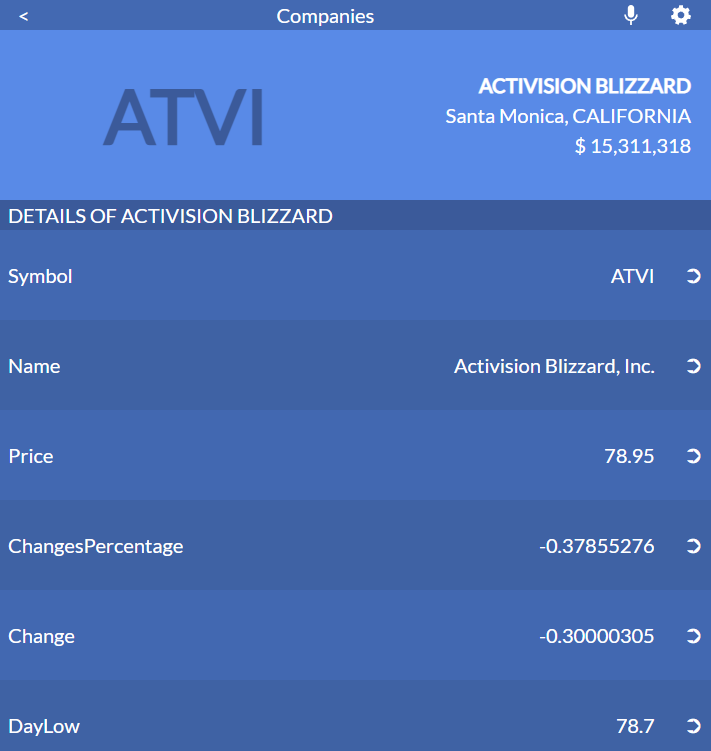

# STOCK PRICE TRACKER

> This is mobile app to easily track the stock price of your favourite companies and currencies.



Project created using `create-react-app` and implementing `react-redux` to retreive information from Stock API.

## Built With

- HTMl, CSS, JavaScript, Tailwind.
- React.
- Redux.

## Live Demo

[Live Demo Link](https://stock-capstone.herokuapp.com/)

[Explanatory video](https://drive.google.com/file/d/1tu6x65IFPv1Dd-NZyDcdi3JUgugpPrqK/view)


## Getting Started

To get a local copy up and running follow these simple example steps.

### Prerequisites
* A functional computer with VS Code or any functional coding software.
* Git bash or any version control software.

### Setup
* Copy the repo link and clone it in your local machine
* You can execute the following command in your git bash:
    ```` 
    git clone https://github.com/MacCrazyman/stock-capstone.git
    ````

### Install
* In your consle, run the following command to install the required dependencies:
    ````
    npm install
    ````


### Usage
* You can build the files using React scripts to generate a `/build` folder with distribution files:
    ````
    npm run build
    ````
* Run React server to see the webpage working:
    ````
    npm start
    ````
* You can also open the [Heroku deployment](https://stock-capstone.herokuapp.com/) to see a live version of the webpage.


## Author

👤 **Leonardo Pareja**

- GitHub: [@MacCrazyman](https://github.com/MacCrazyman)
- Twitter: [@MacCrazyman](https://twitter.com/MacCrazyman)
- LinkedIn: [Leonardo Pareja](https://www.linkedin.com/in/leonardo-pareja-pareja/)

## Acknowledgements

* Original design idea by [Nelson Sakwa on Behance](https://www.behance.net/sakwadesignstudio)
* Data provided by [Financial Modeling Prep](https://financialmodelingprep.com/developer/docs/)

## 🤝 Contributing

Contributions, issues, and feature requests are welcome!

Feel free to check the [issues page](../../issues/).

## Show your support

Give a ⭐️ if you like this project!


## 📝 License

This project is [MIT](./LICENSE) licensed.
